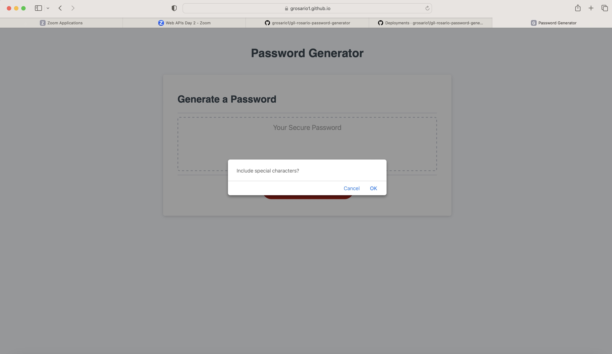
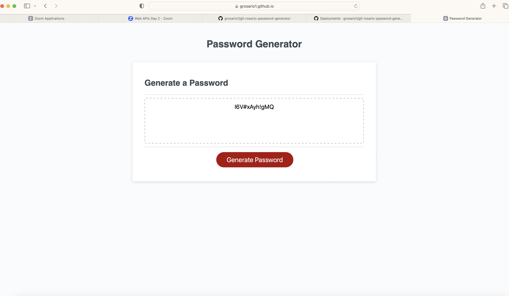

# gil-rosario-password-generator
## Description

The password generator app deployed within this repos will run in the browser, and will feature dynamically updated HTML and CSS powered by javascript code that was written on top of the starter code. It will have a clean and polished user interface that is responsive, ensuring that it adapts to multiple screen sizes. The app will allow for users to generate a random password based upon input provided through the prompts allowing users to not need to think of a complex password on their own. The generator will not provide the same password twice, and will always be randomized. 

## Installation

This site was deployed using github pages. 
The following github documentation link was used to follow steps on deploying github pages: 

https://docs.github.com/en/pages/getting-started-with-github-pages/creating-a-github-pages-site

## Usage

To use the app, click on the deployed live url below. Once on the page, then click on the 'Generate Password' button. 
You will then go through a series of prompts based upon the following: 

 -  Length of characters between 8 and 128 
 -  Whether or not you would like lowercase characters
 -  Whether or not you would like uppercase characters
 -  Whether or not you would like numeric characters
 -  Whether or not you would like special characters

Link to deployed live URL [here.](https://grosario1.github.io/gil-rosario-password-generator/)

You can find code repo [here.](https://github.com/grosario1/gil-rosario-password-generator)

## Credits

N/A

## License

Please refer to the LICENSE in the repo.
